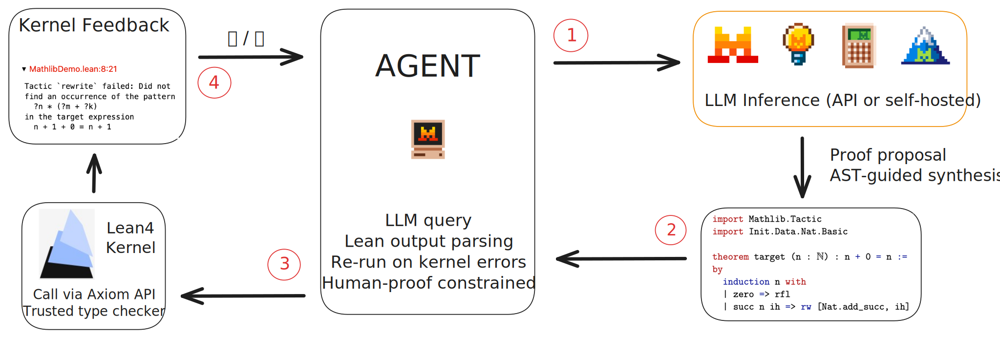

## Lean Verification Agent


Latex-to-Lean4 automatic formalization and verification of mathematical proofs.

Given a .tex file, the system extracts theorem/proof blocks, generates Lean 4 code via an LLM backend (API or self-hosted), sends it to the Lean 4 kernel through the Axiom API, and returns whether it type-checks. Correctness is determined solely by the Lean 4 trusted kernel.

*This project was started during 2026 Mistral AI Hackathon (NYC) and achieved 2nd place :)*



---

### Setup

Python 3.10+ <br>
Unix system recommanded

Python environment:

```
python -m venv .venv
source .venv/bin/activate
pip install -r requirements.txt
```

API Keys:

```
export MISTRAL_API_KEY=mistral_key
export AXLE_API_KEY=axle_key
```

[Axiom Lean Engine](https://axle.axiommath.ai/) (replaces local Lean execution since it is faster, released on March 5, 2026)

To use another model, adapt api_client.py for other API / local models.


Run the app with
```
streamlit run app.py --server.address 127.0.0.1
```
The frontend was largely vibecoded during a hackathon and may not be super safe.
I tried to add some safety checks, but this is not hardened software.
I recommended to run it locally and avoid exposing it to the public network.

---

### Future Work

I will try to turn it into a VSCode extension.

Note that this is not tactic-level proof interaction (no info on the intermediate goals). It is also dependent on LLM quality (Mistral works well here).