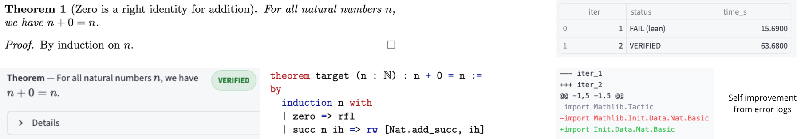

## Lean Verification Agent

Latex-to-Lean4 automatic formalization and verification of mathematical proofs. Started at the Mistral Worldwide Hackathon (NYC).

Given a .tex file, the system extracts theorem/proof blocks, generates Lean4 code via an LLM backend (API or self-hosted), compiles it locally, and reports whether it type-checks. Correctness is decided solely by the Lean4 trusted kernel.




---

## Setup

- Python 3.10+
- Lean 4
- Unix system recommanded

Lean installation [(elan)](https://github.com/leanprover/elan)
```
curl https://elan.lean-lang.org/elan-init.sh -sSf | sh
elan toolchain install leanprover/lean4:stable
elan default leanprover/lean4:stable
```

Python environment:

```
python -m venv .venv
source .venv/bin/activate
pip install -r requirements.txt
```

```
export MISTRAL_API_KEY=your_key
```

To use another model, adapt api_client.py for other API / local models.

Build Lean dependencies:

```
lake build
```

Run the app with
```
streamlit run lean_agent/app.py --server.address 127.0.0.1
```
The frontend was vibecoded during a hackathon and may not be super safe.
I recommended to run it locally and avoid exposing it to the public network.

---

## Future Work

- I'll try to make it a VSCode extension.
- Parallel compilation could be useful.

Note that this is not tactic-level proof interaction (no info on the intermediate goals). It is also dependent on LLM quality (Mistral works well in our case).

Props to Mistral, Iterate and all the staff for organizing the hackathon, providing us with tips, coffee and food. 🫶