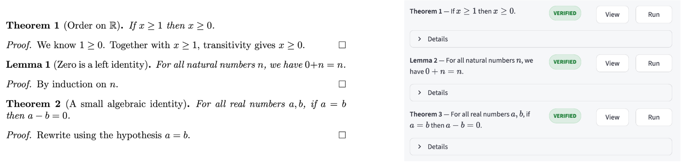
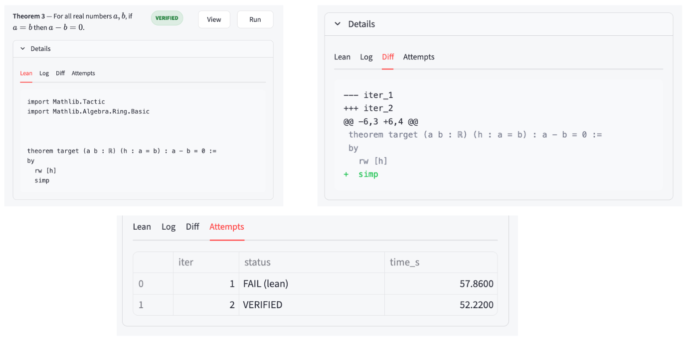

## Verification Agent

Latex to Lean4 automatic formalization of mathematical content. This project was started during Mistral Worldwide Hackathon (NYC location).

Given a .tex file, the system extracts theorems and provided proofs, generates Lean code, compiles it locally, and reports whether the proof type-checks. Correctness is determined only by the Lean compiler





---

## Setup

- Python 3.10+
- Lean 4
- Unix system recommanded

Lean installation [(elan)](https://github.com/leanprover/elan)
```
curl https://elan.lean-lang.org/elan-init.sh -sSf | sh
elan toolchain install leanprover/lean4:stable
elan default leanprover/lean4:stable
```

Setup environment:

```
python -m venv .venv
source .venv/bin/activate
pip install -r requirements.txt
```

```
export MISTRAL_API_KEY=your_key
```

Build Lean once:

```
lake build
```

Run with
```
streamlit run lean_agent/app.py --server.address 127.0.0.1
```

---

## Process

LaTeX → Parsing → LLM query → Lean code → Lean query → error feedback loop.

To use another model, adapt api_client.py for other API / local models.

---

## Future Work

- I'll try to make it a VSCode extension
- Parallel compilation could be useful, but have no idea yet how to do

Note that this is not tactic-level proof interaction (no info on the intermediate goals). It is also dependent on LLM quality (Mistral works well in our case).

Props to Mistral, Iterate and all the staff for organizing the hackathon, providing us with tips, coffee and amazing food. 🫶